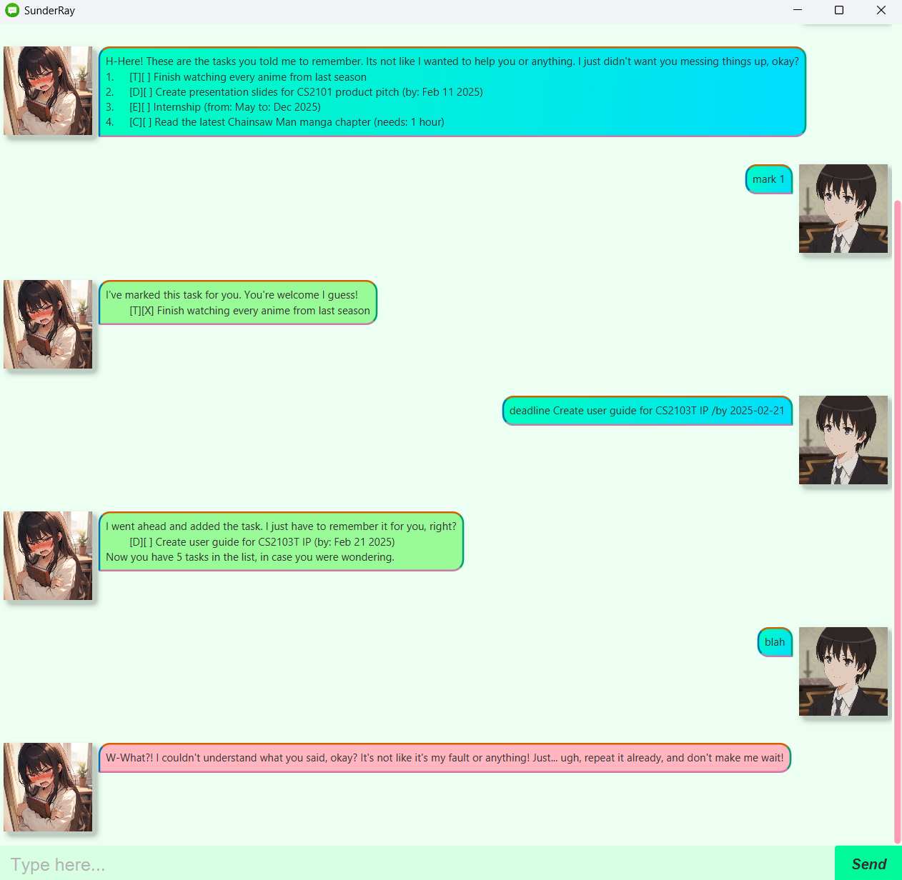

# SunderRay

This is an NUS CS2103T graded individual project written in Java.

Tired of boring task managers that just... do their job?
Meet SunderRay. Your slightly rude, secretly caring AI assistant that keeps you on track with a touch of attitude!
Try SunderRay today. But don't get too attached, okay? It's not like it likes helping you or anything...

