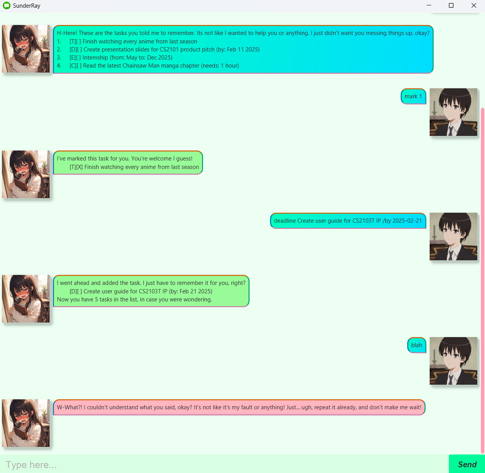

# SunderRay User Guide



Tired of boring task managers that just... do their job?
Meet SunderRay. Your slightly rude, secretly caring AI assistant that keeps you on track with a touch of attitude!
Try SunderRay today. But don't get too attached, okay? It's not like it likes helping you or anything...

## Adding Todos: `todo`

Adds a Todo task to the list.

Format: `todo <description>`

Example Input: `todo Buy snacks`

Example Output:

```
I went ahead and added the task. I just have to remember it for you, right?
    [T][ ] Buy snacks
Now you have 1 task in the list, in case you were wondering.
```

## Adding Deadlines: `deadline`

Adds a Deadline task to the list.

Format: `deadline <description> /by <yyyy-MM-dd>`

Example Input: `deadline Create presentation slides for CS2101 product pitch /by 2025-02-11`

Example Output:

```
I went ahead and added the task. I just have to remember it for you, right?
    [D][ ] Create presentation slides for CS2101 product pitch (by: Feb 11 2025)
Now you have 2 tasks in the list, in case you were wondering.
```

## Adding Events: `event`

Adds an Event task to the list.

Format: `event <description> /from <when> /to <when>`

Example Input: `event Internship /from May /to Dec 2025`

Example Output:

```
I went ahead and added the task. I just have to remember it for you, right?
    [E][ ] Internship (from: May to: Dec 2025)
Now you have 3 tasks in the list, in case you were wondering.
```

## Adding Fixed Duration Tasks: `timed`

Adds a fixed duration task to the list.

Format: `timed <description> /duration <HH:MM>`

Example Input: `timed Read the latest Chainsaw Man manga chapter /duration <01:00>`

Example Output:

```
I went ahead and added the task. I just have to remember it for you, right?
    [C][ ] Read the latest Chainsaw Man manga chapter (needs: 1 hour)
Now you have 4 tasks in the list, in case you were wondering.
```

## Listing Tasks: `list`

Shows all saved tasks.

Format: `list`

Example Output:

```
H-Here! These are the tasks you told me to remember.
Its not like I wanted to help you or anything. I just didn't want you messing things up, okay?
1.	[T][ ] Finish watching every anime from last season
2.	[D][ ] Create presentation slides for CS2101 product pitch (by: Feb 11 2025)
3.	[E][ ] Internship (from: May to: Dec 2025)
4.  [C][ ] Read the latest Chainsaw Man manga chapter (needs: 1 hour)
```

## Marking a Task as done: `mark`

Marks a task in the list as done.

Format: `mark <task-id>`

Example Input: `mark 1`

Example Output:

```
I've marked this task for you. You're welcome I guess!
	[T][X] Finish watching every anime from last season
```

## Marking a Task as not done: `unmark`

Marks a task in the list as not done.

Format: `unmark <task-id>`

Example Input: `unmark 1`

Example Output:

```
I've unmarked this task for you. You're welcome I guess!
	[T][ ] Finish watching every anime from last season
```

## Deleting a Task: `delete`

Deletes a task from the list.

Format: `delete <task-id>`

Example Input: `delete 1`

Example Output:

```
F-Fine, I've deleted the task for you! I just didn't want to see it cluttering things up, okay?!
	[T][ ] Finish watching every anime from last season
Now you have 3 tasks in the list, in case you were wondering.
```

## Finding a Task: `find`

Finds a task in the list based on a keyword.

Format: `find <keyword>`

Example Input: `find slides`

Example Output:

```
F-Fine, here are the tasks that match your keyword... Don't go thinking I did this for you or anything!
1.	[D][ ] Create presentation slides for CS2101 product pitch (by: Feb 11 2025)
```

## Exiting the program: `bye`

Closes the program.

Format: `bye`

## Saving tasks

Tasks are saved in the hard disk automatically after any command that changes the data.
There is no need to save manually.